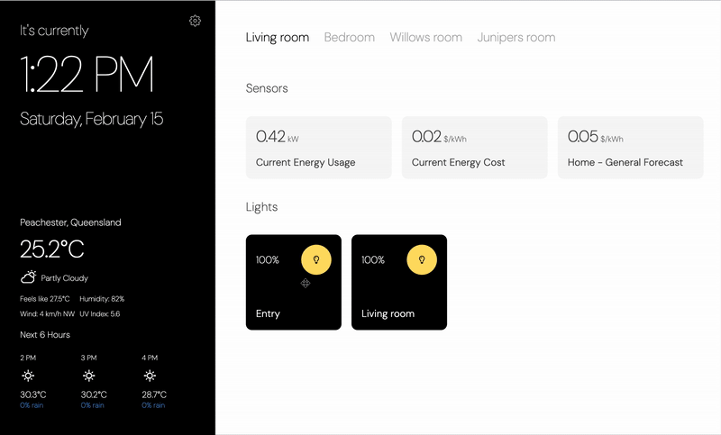

# Project Friday

Project Friday is a modern, simplified dashboard interface designed for Tablet devices, for Home Assistant that provides an intuitive way to control your smart home. It focuses on delivering a clean, customizable interface for managing essential home automation controls.

## Project Friday Dashboard


## Features

### 🎯 Core Features
- **Easy Setup and Configuration**
  - Simple connection to Home Assistant via URL and access token
  - Support for both local and Nabu Casa instances
  - Step-by-step setup wizard

- **Room Management**
  - Create and customize rooms
  - Drag-and-drop entity ordering
  - Entities grouped by type (Lights, Climate, Sensors)

- **Modern Interface**
  - Clean, intuitive dashboard
  - Real-time updates
  - Responsive design
  - Weather information integration
  - Time and date display

### 🏠 Supported Devices

#### Lights
- Toggle on/off
- Brightness control
- Real-time state updates
- Visual feedback

#### Climate
- Temperature control
- Mode selection (Heat, Cool, Auto)
- Fan mode control
- Current temperature display

#### Sensors
- Real-time value display
- Unit display
- Automatic updates

## Getting Started
⚠️ **Warning**: Project Friday only works with Home Assistant Cloud connected (Nabu Casa) instances using your Nabu Casa remote URL. Currently resolving issue with LOCAL IP address setup.
⚠️ **Warning**: Project Friday is currently in active development. While functional, you may encounter bugs or incomplete features. Please report any issues on GitHub.


### Prerequisites
- Python 3.8 or higher
- Home Assistant instance (Nabu Casa)
- Weather API key from [weatherapi.com](https://www.weatherapi.com)

### Installation

1. **Clone Project**
```bash
git clone https://github.com/ambrosecoulter-bestdev/Project-Friday
cd project-friday
```

2. **Setup Environment**
```bash
python3 -m venv venv
source venv/bin/activate  # On Windows: venv\Scripts\activate
```

3. **Install Requirements**
```bash
pip install -r requirements.txt
```

4. **Initialize Database**
```bash
flask db init
flask db migrate
flask db upgrade
```

5. **Configure Environment**
Create a `.env` file in the root directory:
```env
WEATHER_API_KEY=your_weather_api_key
LOCATION=your_location  # e.g., "London" or "51.5074,-0.1278"
```

6. **Run Application**
```bash
python app.py
```

The application will be available at:
- Local: `http://localhost:8165`
- Network: `http://LOCALNETWORKIP:8165`

### First-Time Setup

1. Access Project Friday at the URL
2. Enter your Home Assistant details:
   - Home Assistant URL (e.g., `https://xxx.ui.nabu.casa`)
   - Long-lived Access Token (generated from Home Assistant under Profile > Security)
3. Create rooms and assign entities
4. Customize entity ordering and grouping

## Development

### Project Structure
```
project-friday/
├── app.py              # Main application file
├── config.py           # Configuration settings
├── modules/            # Core modules
│   ├── ha_client.py   # Home Assistant client
│   └── models.py      # Database models
├── static/            # Static assets
│   ├── css/          # Stylesheets
│   ├── js/           # JavaScript files
│   └── images/       # Images and icons
└── templates/        # HTML templates
```

### Key Components

- **Frontend**: Pure JavaScript/HTML/CSS implementation
- **Backend**: Flask-based Python server
- **Database**: SQLite with Flask-SQLAlchemy
- **Real-time Updates**: WebSocket communication
- **API Integration**: Home Assistant API, Weather API

## Contributing

1. Fork the repository
2. Create a feature branch (`git checkout -b feature/AmazingFeature`)
3. Commit changes (`git commit -m 'Add AmazingFeature'`)
4. Push to branch (`git push origin feature/AmazingFeature`)
5. Open a Pull Request

## License

This project is licensed under the MIT License - see the [LICENSE](LICENSE) file for details.

## Acknowledgments

- [Home Assistant](https://www.home-assistant.io/) for their amazing platform
- [Weather API](https://www.weatherapi.com) for weather data
- All contributors and users of Project Friday

## Support

For support, please:
1. Check the [Issues](https://github.com/ambrosecoulter-bestdev/Project-Friday/issues) page
2. Create a new issue if your problem isn't already listed

---

Made with ❤️ by [Ambrose Coulter](https://github.com/ambrosecoulter-bestdev)